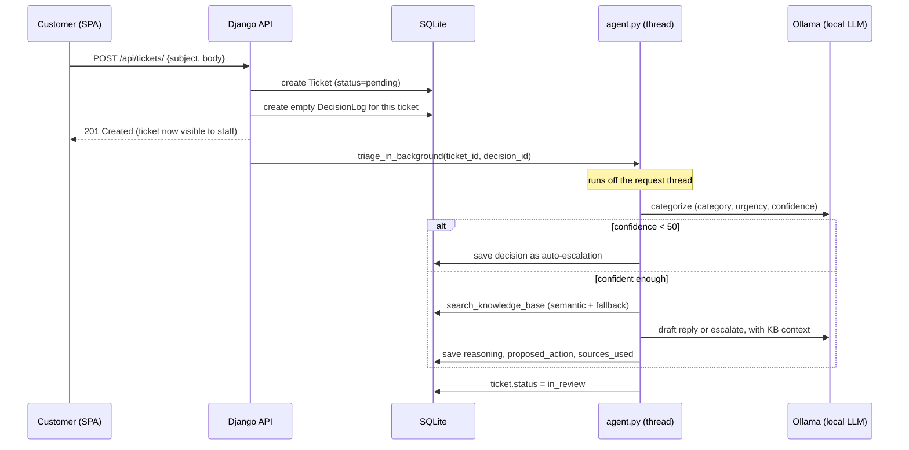
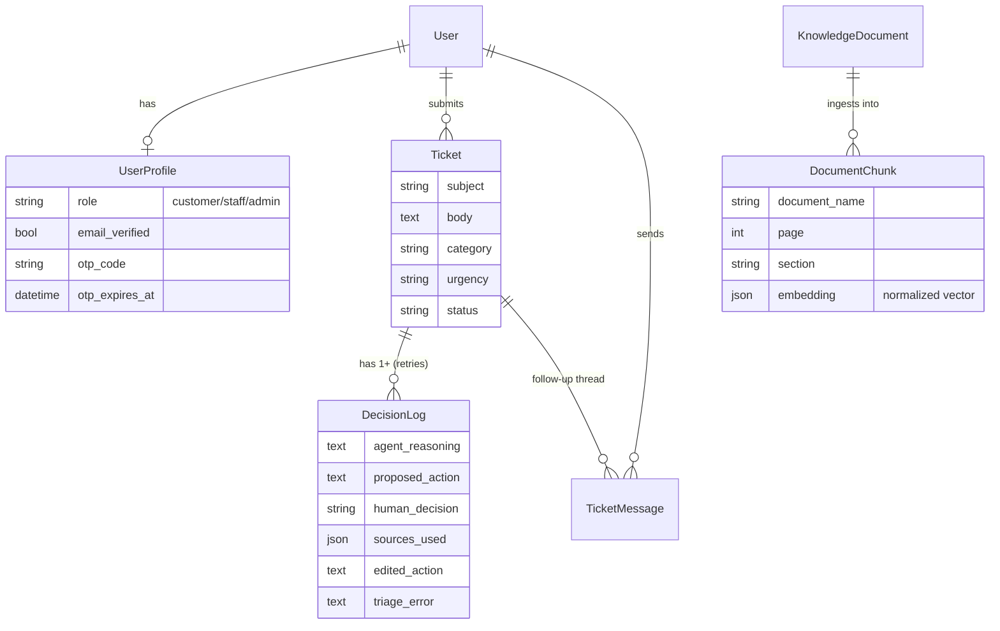

# TriagePilot

A human-in-the-loop support-ticket triage system: a locally-hosted LLM reads each incoming ticket, retrieves evidence from a RAG knowledge base, and proposes a categorized action — but nothing reaches a customer until a support operator approves, edits, or rejects it.

## Overview

Most "AI support" demos are a chatbot bolted onto a document index: fast to build, but they can't show their work and there's no gate before a wrong answer reaches a customer. TriagePilot inverts that. The agent's output is a *proposal*, not a reply — it lands in a staff queue alongside its reasoning, its confidence, and the exact knowledge-base passages it cited, and an operator has to act on it before anything is sent.

The engineering problem underneath that framing is what makes the project interesting:

- **The agent must never be a single point of failure for visibility.** A ticket has to appear in the staff queue the instant it's submitted, whether the LLM call that follows succeeds, times out, or throws — otherwise a flaky model silently drops tickets on the floor. That invariant is enforced structurally (see [Business Logic](#business-logic)) and is the one thing the test suite exists to protect.
- **The retrieval layer is built to swap storage engines without a rewrite.** It runs today as a pure-Python cosine scan over JSON-encoded vectors in SQLite, but the chunking, normalization, and schema are shaped so the only change needed to move to PostgreSQL + pgvector is a field type and an `ORDER BY`.
- **A synchronous request can't wait on local LLM inference.** Categorization plus response drafting is two sequential Ollama calls, which can run past a typical request timeout — so triage is dispatched to a background thread and the queue polls for the result.

## Key Features

**Implemented**
- Two-role auth: customers submit and track tickets; staff/admin work the triage queue. Enforced in JWT claims and DRF permission classes, not just the UI.
- Email OTP verification on signup (6-digit code, 10-minute expiry, 60-second resend cooldown); sign-in is blocked until the email is confirmed.
- JWT access/refresh auth with automatic refresh-on-expiry and refresh-token rotation.
- Ticket submission that never blocks on the AI agent — the ticket is queryable and visible in the staff queue immediately, before triage finishes.
- LLM-driven triage: category, urgency, and a confidence score; a confidence-threshold safety net that force-escalates ambiguous tickets instead of guessing.
- RAG knowledge-base search: semantic search over ingested PDFs (chunked, embedded, cosine-ranked), falling back to a keyword-scored static article set when nothing is indexed.
- Agent-drafted replies with cited sources, or an escalation with a stated reason, for staff to approve / edit / reject.
- Full audit trail per ticket (`DecisionLog`): the agent's reasoning, its proposed action, its sources, the human's decision, and any edit — plus the error, if the agent run failed.
- Manual re-triage endpoint for tickets whose first run errored.
- Customer/staff follow-up messaging on a resolved ticket, with a 3-in-a-row rate limit on unanswered customer messages.
- Ticket closing (by its owner) and deletion (owner or staff, closed tickets only).
- Django admin workflow for uploading a PDF straight into the RAG index (extract → chunk → embed → store on save).

**Specified but not built** (see [PRODUCT.md](PRODUCT.md)): a dedicated escalation view, confidence display in the queue UI, search/filter over historical tickets, and a metrics dashboard (deflection rate, time-to-resolution, override rate). None of these are represented in the UI.

**Not implemented**: Docker, CI/CD, deployment configuration, and automated frontend tests (Vitest and Testing Library are installed but no test files exist yet).

## Tech Stack

| Layer | Technology | Purpose |
|---|---|---|
| Frontend | React 19, Vite, React Router 7 | SPA shell, client-side routing |
| Frontend | Tailwind CSS v4, framer-motion, lucide-react | Styling, motion, icons |
| Frontend | axios, jwt-decode, react-hook-form | API client, JWT decoding, form handling |
| Backend | Django 6, Django REST Framework | API server, ORM, serialization |
| Backend | djangorestframework-simplejwt | JWT issuance, refresh, blacklisting |
| Backend | django-cors-headers | Cross-origin requests from the Vite dev server |
| AI / RAG | Ollama (`llama3.2` for reasoning, `mxbai-embed-large` for embeddings) | Local LLM inference and text embedding, no external API key needed |
| AI / RAG | pypdf | PDF text extraction for KB ingestion |
| Database | SQLite (dev) | Tickets, decisions, users, and vector chunks (JSON column) |
| Testing | Django `TestCase` + DRF `APIClient`, `unittest.mock` | Backend integration tests |
| Infrastructure | Gunicorn, WhiteNoise | Present in `requirements.txt` for production-style serving; no deployment config wired up yet |

## System Architecture

```text
                     ┌─────────────────────────┐
                     │   React SPA (Vite)      │
                     │  customer & staff UIs    │
                     └────────────┬─────────────┘
                                  │ HTTP (JWT bearer), proxied
                                  │ /api → :8000 in dev
                                  ▼
                     ┌─────────────────────────┐
                     │   Django REST API        │
                     │  auth · tickets · queue   │
                     └──┬───────────────┬────────┘
                         │               │
        creates row,     │               │ background thread
        returns 201      │               │ (non-blocking)
                         ▼               ▼
              ┌────────────────┐   ┌───────────────────────┐
              │  SQLite         │   │  Agent pipeline        │
              │  Ticket /       │◄──┤  (tickets/agent.py)    │
              │  DecisionLog /  │   │  categorize → search KB │
              │  DocumentChunk  │   │  → draft or escalate    │
              └────────────────┘   └──────────┬──────────────┘
                                               │
                                               ▼
                                   ┌───────────────────────┐
                                   │  Ollama (local)         │
                                   │  llama3.2 (chat)         │
                                   │  mxbai-embed-large (embed)│
                                   └───────────────────────┘
```

**React SPA** — role-gated routing (`ProtectedRoute`) sends customers to `/tickets` and staff to `/triage`; a decoded JWT claim drives the split, re-checked (and silently refreshed) on every protected navigation.

**Django REST API** — a single `tickets` app exposing auth, ticket CRUD, and the decision queue behind DRF permission classes that scope querysets per role.

**Agent pipeline** (`tickets/agent.py`) — two sequential Ollama calls: one to categorize + score confidence, one to draft a reply or escalate using retrieved KB context. Runs on a daemon thread kicked off from the create-ticket request so the HTTP response doesn't wait on inference.

**RAG index** (`tickets/rag.py`, `tickets/knowledge_base.py`) — PDFs uploaded via Django admin are extracted, recursively chunked with heading-aware overlap, embedded, and stored as normalized vectors; search is a Python cosine scan over that table with a static 20-article keyword-scored fallback when the index is empty or nothing scores high enough.

## Project Structure

```text
Triage-Pilot/
├── backend/
│   ├── backend/            # Django project: settings, root urls, WSGI/ASGI
│   ├── tickets/             # the one Django app — all domain logic lives here
│   │   ├── models.py         # Ticket, DecisionLog, DocumentChunk, KnowledgeDocument,
│   │   │                     # TicketMessage, UserProfile
│   │   ├── views.py          # TicketViewSet, DecisionLogViewSet, auth views
│   │   ├── serializers.py    # DRF serializers, incl. JWT claim + OTP serializers
│   │   ├── agent.py          # LLM prompts, Ollama calls, triage orchestration
│   │   ├── rag.py            # PDF extraction, chunking, embedding, similarity search
│   │   ├── knowledge_base.py  # search entry point + static KB fallback articles
│   │   ├── otp.py             # OTP email delivery
│   │   ├── permissions.py     # IsAdmin / IsAgent DRF permission classes
│   │   ├── signals.py         # auto-creates a UserProfile on User creation
│   │   ├── admin.py           # KnowledgeDocument admin (upload → auto-ingest)
│   │   ├── management/commands/ # ingest_pdf, seed_tickets, ad-hoc test/debug commands
│   │   └── tests.py           # the real automated test suite
│   ├── test_*.py             # standalone manual pipeline scripts (need a live Ollama)
│   └── requirements.txt
├── frontend/
│   ├── src/
│   │   ├── pages/            # Landing, Login, TicketList/Detail, NewTicket,
│   │   │                     # TriageQueue, DecisionDetail
│   │   ├── components/        # Layout, ProtectedRoute, MessageThread, ui primitives
│   │   ├── api.js             # axios instance, public-path allowlist for JWT attach
│   │   └── auth.js             # role decoding from the JWT
│   └── vite.config.js         # dev-server proxy: /api → localhost:8000
├── docs/                    # day-by-day build notes from initial development
├── PRODUCT.md               # product scope, audience, and what's explicitly not built
└── AGENTS.md
```

## How the System Works

### Ticket submission and triage



The `DecisionLog` row is created **before** the agent runs, in the same request that creates the ticket. The staff queue is a list of `DecisionLog` rows, so if this were created only on success, a slow, crashed, or Ollama-down triage run would make the ticket invisible to staff with nothing to retry. This ordering is the one behavior [`tickets/tests.py`](backend/tickets/tests.py) is written to protect.

### Human decision

1. Staff opens a pending item in the triage queue and sees the ticket text beside the agent's reasoning, its proposed action, and the KB sources it cited.
2. `POST /api/decisions/{id}/decide/` with `approved`, `rejected`, or `edited` (+ `edited_action` text).
3. The ticket's status flips to `approved` or `rejected`; an approved or edited decision becomes the ticket's customer-facing `resolution`.
4. A retry is available via `POST /api/tickets/{id}/triage/` for any decision that hasn't been decided by a human yet.

### Follow-up thread

A resolved ticket keeps a lightweight message thread (`TicketMessage`) — it does not re-invoke the agent or create a new `DecisionLog`. A staff reply on an `in_review` ticket resolves it back to `approved`; a customer reply on an `approved` ticket reopens it to `in_review`. Customers are capped at 3 consecutive unanswered messages.

## Authentication & Security

- **Registration** (`POST /api/register/`) always creates a `customer` account — there's no way to self-register as staff. It creates the `User` immediately (unverified) and emails a 6-digit OTP.
- **Password hashing**: Argon2id (`tickets.hashers.TriagePilotArgon2PasswordHasher`, `argon2-cffi`) is first in `PASSWORD_HASHERS`, so every new or changed password hashes there; Django's `PBKDF2` hasher stays listed after it so existing users' hashes keep verifying until they next change password. The standard Django validators (similarity, minimum length, common-password, all-numeric) still apply on registration.
- **Email OTP verification**: `POST /api/verify-otp/` checks the code against a 10-minute expiry window; `POST /api/resend-otp/` reissues one, gated by a 60-second cooldown tracked per-user (`otp_last_sent_at`).
- **Sign-in is blocked pre-verification**: `CustomTokenObtainPairSerializer` raises a validation error with `code: "email_not_verified"` if `profile.email_verified` is false, even with correct credentials.
- **JWT via SimpleJWT**: access tokens live 1 hour, refresh tokens 7 days, with `ROTATE_REFRESH_TOKENS` and `BLACKLIST_AFTER_ROTATION` on. The custom serializer embeds `role` in the access token so the frontend can route without an extra API call.
- **Refresh token reuse detection**: rotation + one-shot use is SimpleJWT's blacklist doing its job; `TokenFamily` (`tickets/models.py`) links every `OutstandingToken` to the `family_id` it was issued under at login. If a refresh token is replayed after already being rotated — `CookieTokenRefreshSerializer` sees its jti already blacklisted — every `OutstandingToken` sharing that family gets blacklisted too, not just the replayed one, since the server can no longer tell the legitimate holder from whoever replayed it.
- **Storage**: the refresh token lives in an httpOnly, `SameSite=Strict` cookie scoped to the `/api/token/` path (`secure` in production, off under `DEBUG` for local http) — never reachable from JS. The access token lives only in memory on the client (`frontend/src/auth.js`'s external store, read by React via `useSyncExternalStore` and by the axios interceptor directly) — never `localStorage`. A page reload loses it by design; `ProtectedRoute` recovers it with a silent `POST /api/token/refresh/` against the cookie, and the axios response interceptor does the same on a live 401.
- **Authorization**: `IsSupportStaff` / `IsAgent` / `IsAdmin` DRF permission classes gate staff-only endpoints; `TicketViewSet.get_queryset` additionally scopes customers to their own tickets at the ORM level, so role checks aren't just a UI concern.
- **CORS**: `django-cors-headers`, allowlisting `http://localhost:5173` with credentials enabled — a single, explicit dev origin, not a wildcard.
- **Rate limiting**: `/api/token/` and `/api/register/` carry DRF `AnonRateThrottle` scopes (`login`: 5/min, `register`: 3/min) to blunt credential stuffing and mass signup, distinct from the follow-up-message thread's own limit (3 consecutive customer messages before a staff reply is required).
- **Input validation**: DRF serializers validate all write paths (registration email uniqueness, OTP format, decision payload shape).
- **Secrets**: `SECRET_KEY` and `DEBUG` are read from the environment (`backend/.env`, loaded via `python-dotenv`) with dev-only fallbacks, so nothing real has to live in `settings.py`.

Known gaps, honestly: there's no CSRF concern in practice since the API is JWT-only and stateless, and the login/register throttle scopes are in-process (DRF's default cache-backed throttle), so they reset per-worker rather than being enforced globally across a multi-process deployment.

## Database

SQLite for development (`backend/db.sqlite3`), via the Django ORM — no raw SQL in the app. Schema managed through 14 migrations.



**Notable constraints and design choices**

- `UserProfile` is a strict `OneToOne` with `User`, auto-created via a `post_save` signal (`tickets/signals.py`) — every user is guaranteed a profile, no defensive `getattr` needed at the model layer (views still use `getattr(user, 'profile', None)` defensively since a profile could be missing on legacy data).
- `DocumentChunk` has a `unique_together` on `(document_name, chunk_index)`, and re-ingesting a document deletes its previous chunks first — ingestion is idempotent, not additive.
- `DecisionLog.triage_error` doubles as a state machine: empty + no `proposed_action` means triage is still running; empty + a `proposed_action` means it's ready for a human; non-empty means the last run failed.
- `Ticket.created_by` is nullable to tolerate tickets not tied to a user (seed data), but the API always sets it from the authenticated requester.
- The `embedding` field is a `JSONField`, documented in-model as a deliberate stand-in for a future `pgvector.VectorField` — the normalize-on-write step exists specifically so cosine similarity is a plain dot product today and an `ORDER BY embedding <=> %s` after the swap.

## API

All endpoints are prefixed `/api/`. All ticket/decision endpoints require a JWT bearer token.

| Method | Endpoint | Description | Auth |
|---|---|---|---|
| POST | `/token/` | Sign in, returns access + refresh JWT (role embedded) | Public |
| POST | `/token/refresh/` | Exchange a refresh token for a new access token | Public |
| POST | `/register/` | Create a customer account, sends OTP email | Public |
| POST | `/verify-otp/` | Confirm the emailed OTP code | Public |
| POST | `/resend-otp/` | Reissue an OTP (60s cooldown) | Public |
| GET | `/tickets/` | List tickets — own tickets for customers, all for staff | Required |
| POST | `/tickets/` | Submit a ticket; triggers background triage | Required |
| GET | `/tickets/{id}/` | Ticket detail, incl. resolution if decided | Required |
| DELETE | `/tickets/{id}/` | Delete a **closed** ticket (owner or staff) | Required |
| POST | `/tickets/{id}/triage/` | Retry the agent for a not-yet-decided ticket | Staff |
| GET | `/tickets/{id}/messages/` | Follow-up thread | Required |
| POST | `/tickets/{id}/messages/` | Post a follow-up (rate-limited for customers) | Required |
| POST | `/tickets/{id}/close/` | Close own ticket | Owner only |
| GET | `/decisions/?status=pending` | Triage queue (undecided + reopened items) | Staff |
| GET | `/decisions/{id}/` | Decision detail with full ticket context | Staff |
| POST | `/decisions/{id}/decide/` | Approve / reject / edit a proposal | Staff |

**Example — deciding a ticket:**

```json
POST /api/decisions/42/decide/
{
  "decision": "edited",
  "edited_action": "Your refund was processed on the 12th; it can take 3-5 business days to appear."
}
```

## Business Logic

- **The visibility invariant**: a `DecisionLog` exists for a ticket from the moment it's created, independent of whether the agent ever completes. This is the one rule the backend test suite exists to verify — see [`TriageVisibilityTests`](backend/tickets/tests.py).
- **Confidence gate**: any categorization under 50% confidence is force-escalated rather than acted on, regardless of what the model proposed next — `categorize_ticket` short-circuits before the drafting call even runs.
- **Retry is decision-gated, not state-gated**: `POST /tickets/{id}/triage/` refuses to re-run once a human has recorded a decision (`decision.human_decision` is set), so a retry can't silently overwrite a human's call — but it *is* allowed to reuse the same `DecisionLog` row rather than creating a new one, keeping one log per ticket per open decision.
- **Follow-up reopening is bidirectional**: a staff reply resolves an `in_review` ticket back to `approved`; a customer reply on an `approved` ticket reopens it to `in_review`. The pending-queue filter (`status=pending`) matches both never-decided decisions and this reopened state, so a customer follow-up always resurfaces the ticket for staff.
- **Deletion is closed-tickets-only**: `perform_destroy` raises `PermissionDenied` for any ticket not already in `closed` status, for either owner or staff.
- **KB citation discipline**: the drafting prompt explicitly forbids citing an article ID that wasn't in the retrieved context, to keep "sources cited" trustworthy rather than hallucinated.

## Error Handling

- **Validation errors**: DRF serializer `ValidationError`s return `400` with a field-keyed error body (e.g. duplicate email on registration, invalid/expired OTP, missing `edited_action` when `decision: "edited"`).
- **Authentication errors**: an invalid/expired JWT returns `401`; the frontend interceptor omits the `Authorization` header entirely on public auth routes so a stale token can't produce a false `401` on login.
- **Authorization errors**: staff-only endpoints return `403` via DRF permission classes; ticket-close returns an explicit `403` with `{"detail": "Only the ticket owner can close it."}` when the caller isn't the owner.
- **Not found**: DRF's default `404` for an unmatched or out-of-scope object id (a customer requesting another customer's ticket 404s rather than 403s, since `get_queryset` already filters it out).
- **Conflict-shaped errors**: re-deciding an already-decided ticket, or closing an already-closed one, return `400` with a descriptive `detail` message rather than a generic error.
- **Rate limiting**: exceeding the follow-up message cap returns `429` with `{"detail": "Please wait for a staff reply before sending more follow-ups."}`.
- **Agent/inference failures**: caught in `apply_triage`, written to `DecisionLog.triage_error`, and re-raised; the manual retry endpoint (`/tickets/{id}/triage/`) catches that and returns `500` with the error string plus the `decision_log_id` so staff can identify what to retry. Background (first-run) failures are logged server-side (`logger.exception`) and leave the ticket visible in the queue with `triage_error` set, rather than surfacing an HTTP error to anyone.

## Testing

**Backend** — Django's test runner (`TestCase` + DRF's `APIClient`), with the LLM call mocked out so tests run without Ollama:

```bash
cd backend
python manage.py test
```

The suite ([`tickets/tests.py`](backend/tickets/tests.py)) covers the visibility invariant described above: a ticket appears in the staff queue immediately on submission, stays there (with its error recorded) if the agent throws, and a retry reuses the existing `DecisionLog` rather than duplicating it.

Also present, run independently and requiring a live Ollama instance (manual/exploratory, not part of the automated suite):

```bash
python test_triage_pipeline.py       # run seeded tickets through the full pipeline
python test_confidence_threshold.py  # exercise the low-confidence auto-escalation path
python test_rag_chunking.py          # offline self-check of the chunking logic — no Ollama needed
```

**Frontend** — Vitest and React Testing Library are installed (`frontend/package.json`) but no test files exist yet. Not currently implemented.

## Local Development

### Prerequisites

- Python 3.13
- Node.js (for Vite 8 / React 19 — Node 20+ recommended)
- [Ollama](https://ollama.com), with the models the agent uses pulled locally:
  ```bash
  ollama pull llama3.2
  ollama pull mxbai-embed-large
  ```

### Installation

```bash
# Backend
cd backend
python -m venv env
env\Scripts\activate        # Windows; use `source env/bin/activate` on macOS/Linux
pip install -r requirements.txt

# Frontend
cd ../frontend
npm install
```

### Environment Variables

Backend reads from `backend/.env` (loaded via `python-dotenv`). Only email delivery is externally configurable; everything else has a working local default.

| Variable | Purpose | Required |
|---|---|---|
| `EMAIL_HOST_USER` | SMTP username for sending OTP emails | No — omit to print emails to the console instead |
| `EMAIL_HOST_PASSWORD` | SMTP password | No — same fallback as above |
| `DEFAULT_FROM_EMAIL` | From-address for outgoing mail | No — defaults to `TriagePilot <no-reply@triagepilot.local>` |
| `EMAIL_HOST` | SMTP host | No — defaults to `smtp.gmail.com` |
| `EMAIL_PORT` | SMTP port | No — defaults to `587` |
| `EMAIL_USE_TLS` | Use TLS for SMTP | No — defaults to `true` |
| `VITE_API_URL` (frontend) | Override the API base URL | No — defaults to the Vite dev proxy (`/api` → `localhost:8000`) |

Without `EMAIL_HOST_USER`/`EMAIL_HOST_PASSWORD` set, OTP codes print to the Django console (`EmailBackend` = console) — sufficient for local development.

### Database Setup

```bash
cd backend
python manage.py migrate
python manage.py seed_tickets      # optional: sample tickets for local testing
```

To populate the RAG index with real documents instead of the static fallback KB:

```bash
python manage.py ingest_pdf docs/refund-policy.pdf --category billing
```

(or upload a PDF through `/admin/` under **Knowledge Documents** — ingestion runs automatically on save.)

### Running the Application

Four processes, each in its own terminal:

```bash
# 1. Ollama (if not already running as a service)
ollama serve

# 2. Django API
cd backend
python manage.py runserver

# 3. React dev server
cd frontend
npm run dev

# 4. (optional) create a staff account via Django admin
cd backend
python manage.py createsuperuser
# then set role = 'staff' or 'admin' for that user in /admin/
```

The SPA runs at `http://localhost:5173` and proxies `/api` to `http://127.0.0.1:8000`.

## Docker

Not currently implemented — no `Dockerfile` or `docker-compose.yml` in the repository.

## Deployment

Not currently implemented. `gunicorn` and `whitenoise` are present in `requirements.txt`, which suggests production-style serving was anticipated, but there's no deployment configuration, `Procfile`, or CI/CD pipeline in the repository, and `settings.py` still has `DEBUG = True` and a hardcoded `SECRET_KEY` unconditionally.

## Engineering Decisions

- **`DecisionLog` is created before triage runs, not after.** The alternative — creating it on success — is simpler, but means a crashed or slow agent makes the ticket invisible to the one queue that's supposed to catch it. The trade-off is a small amount of extra state-machine reasoning (`triage_error` as an implicit status field) in exchange for that invariant.
- **A background thread, not a task queue, for triage.** Ollama inference takes tens of seconds — long enough to blow a typical request timeout, short enough that a full Celery/RQ setup is more infrastructure than the problem needs. The documented ceiling: if the process dies mid-run, the decision sits unresolved until a human hits retry. That's an accepted trade for local-first, zero-extra-infra development; the code marks the swap-out point explicitly (`tickets/agent.py`).
- **Vectors as a JSON column with Python cosine, not pgvector, for now.** The project runs on SQLite in development; pgvector needs PostgreSQL. Rather than stand up Postgres just for local dev, the schema and the normalize-on-write step are shaped so the eventual move is a field-type change plus an `ORDER BY`, not a rewrite of `rag.py`.
- **Static KB articles as a fallback, not a replacement, for the RAG index.** Semantic search is empty until a document is ingested; falling back to keyword-scored hardcoded articles means the agent can draft a plausible answer from day one, and the fallback silently stops mattering once real documents are indexed.
- **Role is embedded in the JWT rather than fetched separately.** One extra claim on token issuance means the frontend can route (`ProtectedRoute`) without an additional round-trip on every page load — at the cost of the claim going stale until the next token refresh if an admin changes a user's role mid-session.
- **Customer signup requires email verification; staff accounts don't self-register at all.** Support-staff provisioning is inherently a trusted, admin-mediated action (Django admin), so OTP friction is spent only where it matters — the public signup surface.

## Security Considerations

Implemented: Argon2id password hashing (PBKDF2 kept for existing hashes), JWT auth with refresh rotation + blacklisting + family-based reuse detection, the refresh token in an httpOnly/SameSite=Strict cookie with the access token kept in-memory client-side only, role-scoped querysets (not just permission checks), explicit CORS allowlist, DRF serializer-level input validation on every write path, login/register throttling on top of the follow-up message rate limit, and `SECRET_KEY`/`DEBUG` read from the environment.

Not implemented / known gaps: no CSRF concern in practice since the API is JWT-only and stateless; login/register throttling is DRF's default in-process cache, so it isn't shared across worker processes in a multi-process deployment; and there's still no general-purpose API rate limiting beyond those two scopes plus the follow-up-message path.

## Performance & Scalability

**Current implementation:**
- Pagination is on by default for all list endpoints (`PageNumberPagination`, page size 10).
- Triage runs off the request thread so ticket submission stays fast regardless of LLM latency.
- Chunk embeddings are stored pre-normalized so similarity search is a dot product, not a full distance recomputation.

**Explicitly not scalable yet, by design (documented in-code as such):**
- KB similarity search is a full Python table scan over every `DocumentChunk` — fine at a few thousand chunks, a real bottleneck beyond that. The fix is a schema migration to PostgreSQL + pgvector with an `ORDER BY … <=>` query, not an algorithm change.
- Background triage is a raw daemon thread per ticket with no queue, backpressure, or retry-on-crash — acceptable at demo/dev scale, not under concurrent load. The documented next step is Celery or RQ.
- SQLite itself is a single-writer database; a concurrent multi-user deployment would need PostgreSQL regardless of the vector-search question above.

## Future Improvements

Prioritized by what would most change the project's production-readiness, not by size:

1. Move triage off a daemon thread onto a real task queue (Celery/RQ), so a crashed process doesn't strand a decision mid-run.
2. Migrate `DocumentChunk` embeddings to PostgreSQL + pgvector — the schema is already shaped for it.
3. Add production settings (`ALLOWED_HOSTS`, a cache-backed throttle so login/register limits hold across worker processes) as a distinct settings module. `SECRET_KEY`/`DEBUG` are already environment-driven.
4. Extend rate limiting beyond `/api/token/`, `/api/register/`, and the follow-up-message check to the rest of the write-path API.
5. Build the confidence-signaling and metrics-dashboard surfaces already specified in [PRODUCT.md](PRODUCT.md) but intentionally left unbuilt.
6. Add a CI pipeline running the existing Django test suite, plus actual frontend tests using the already-installed Vitest/Testing Library setup.

## Screenshots / Demo

Not available — no screenshots are checked into the repository and no live deployment exists yet.

## Author

Gandib Paudel
